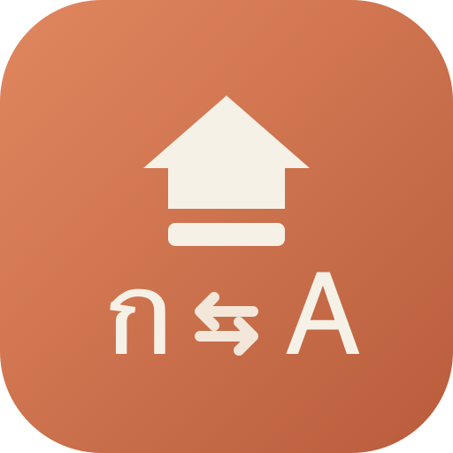

<p align="center">
  
</p>

<h1 align="center">CapsLangSwitcher</h1>

<p align="center">
  Tap Caps Lock, switch input languages — instantly. No macOS hotkey delay, ever.
</p>

## Why

On macOS, binding Caps Lock to "switch input source" goes through the system's
hotkey-disambiguation logic, which adds a noticeable delay before the switch
actually happens — especially annoying for Thai/English (ก/A) switching.

CapsLangSwitcher fixes this by grabbing the physical Caps Lock key at the HID
level with a `CGEventTap`, swallowing the key's native "toggle caps" behavior
entirely, and calling the Text Input Source Services API (`TISSelectInputSource`)
directly, in-process, the instant the key goes down. There's no OS hotkey
subsystem involved, so there's no delay to work around.

## Features

- **Zero-delay switching** — bypasses the OS hotkey-disambiguation delay entirely
- **Real Caps Lock repurposed** — the physical key never triggers actual caps
  lock while the app is running
- **Cycles any input sources** — works with however many keyboard layouts you
  have enabled, not hardcoded to Thai/English
- **Lives in the menu bar** — shows the current input source, no Dock icon
- **Featherweight** — pure Swift, no Electron, tiny binary

## Install

Download the latest build from [Releases](https://github.com/Gamezxz/CapsLangSwitcher/releases),
unzip, and move `CapsLangSwitcher.app` to `/Applications`.

It's an unsigned developer build (not notarized), so the first time you open
it, right-click → **Open** to get past Gatekeeper.

### Build from source

```bash
git clone https://github.com/Gamezxz/CapsLangSwitcher.git
cd CapsLangSwitcher
./build_app.sh
open CapsLangSwitcher.app
```

Requires Xcode Command Line Tools (Swift 5.9+).

## Setup

1. Launch the app once — it will prompt for **Accessibility** access
   (System Settings → Privacy & Security → Accessibility). Allow it.
2. Go to System Settings → Keyboard → Keyboard Shortcuts → Input Sources, and
   turn off any existing shortcut bound to Caps Lock (e.g. "Select previous
   input source") so it doesn't fight with the app.
3. Tap Caps Lock. Your input source switches immediately.

## How it works

- `CapsLockTap.swift` — a `CGEventTap` at `.cghidEventTap` listening for
  `flagsChanged` events on keycode 57 (Caps Lock). Every event for that key is
  swallowed (`return nil`), so the real caps-lock state never changes. A tap
  fires `onTap` once per physical press (deduped by tracking the AlphaShift
  bit transition, since the press and release events for this key report the
  same bit value).
- `InputSourceSwitcher.swift` — enumerates the enabled, selectable keyboard
  input sources via `TISCreateInputSourceList` and calls `TISSelectInputSource`
  on the next one in the list, mirroring what the system's own "next input
  source" shortcut does.
- `main.swift` — a menu-bar-only (`LSUIElement`) app that wires the two
  together and shows the current input source's abbreviation in the status bar.

## License

MIT
